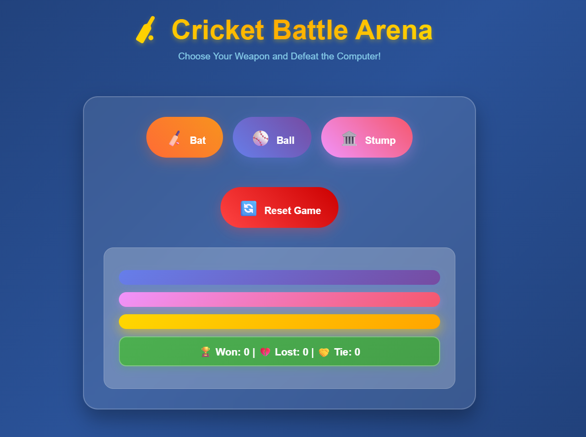
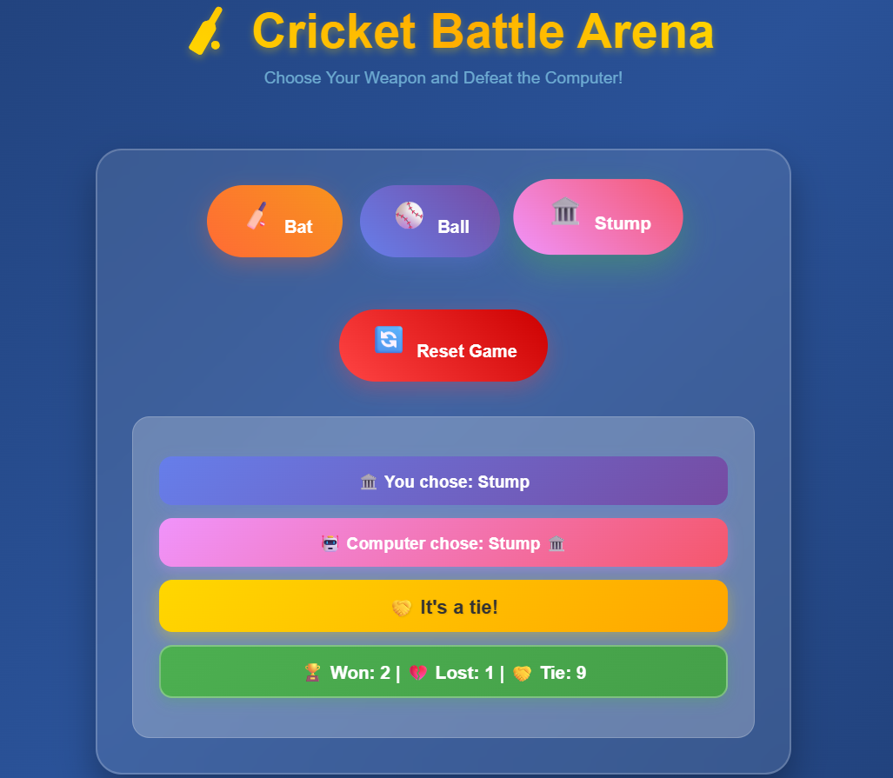

# Bat-Ball-Stump-Battle
A fun and interactive Bat Ball Stump game built with HTML, CSS, and JavaScript.  
Play against the computer, track your score with localStorage, and enjoy animated feedback and a modern UI.

## Screenshots
#Game Start:

#Gameplay: 

#Result Animation:

## Features
- Play Bat, Ball, or Stump against the computer
- Animated buttons and result display
- Score tracking with localStorage (persists across sessions)
- Responsive and visually engaging interface

## How to Play
1. Click on Bat, Ball, or Stump to make your move.
2. The computer will randomly choose its move.
3. The result and updated score will be displayed.
4. Click "Reset" to clear your score.

## Demo
[My GitHub Pages link here after deployment]

## Technologies Used
- HTML
- CSS
- JavaScript

---

Feel free to fork, star, or contribute!
